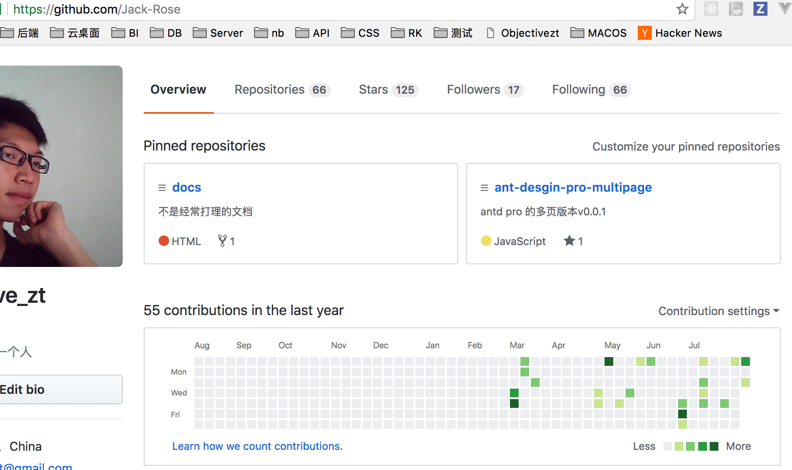
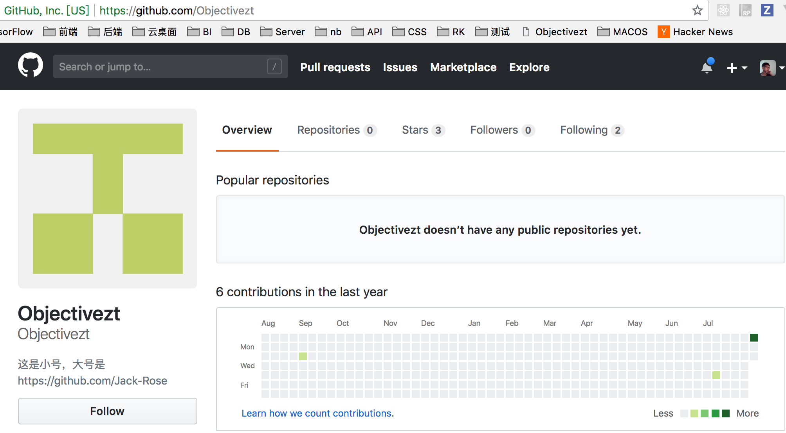

# github

## 记录一次提交贡献图问题

前一段时间我都是用github.com/objectivezt 这个账号提交的。

发现一个问题，在项目中可以看到自己的提交。






发现大号小号都没有

通过看到了`https://help.github.com/articles/why-are-my-contributions-not-showing-up-on-my-profile/`
问题所以在

>本地全局没有配置邮箱

```bash
 git config -l
```

没有user.email 项

```bash
 git config --global user.email 'objectivezt@gmail.com'
```

就ok了